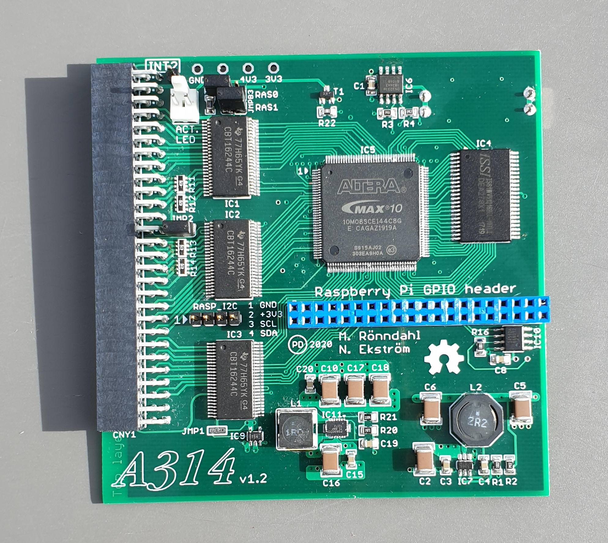
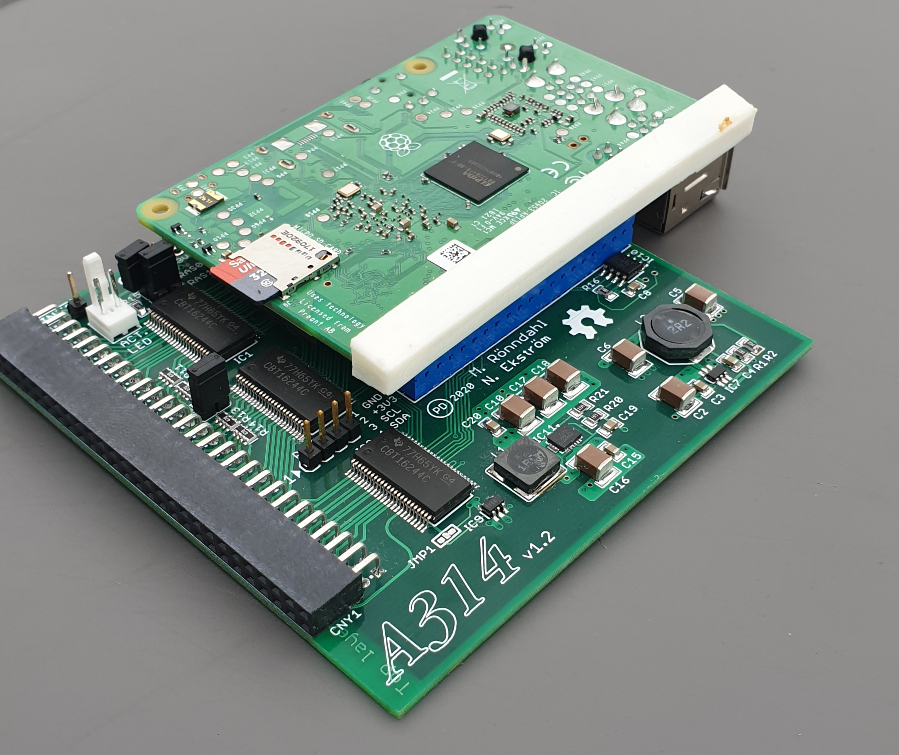

# A314-500 PCB versions Beta-2 to 1.2 in Autodesk EAGLE format
A314 for Amiga 500 trapdoor

This repository contains the neccesary files for building an A314 for the Amiga 500's trapdoor.  
The Eagle branch contain the original design from 2018-2020, which was made using CadSoft Eagle v.7 
This design uses the Altera MAX10 FPGA, and has a serial connection (SPI) with the RPi.

It is suggested that You use the latest/newest available version of the hardware/PCB, as older revisions may need specialized firmware and software, or may even be incompatible with the latest features of the software suite.

You can find the belonging FPGA binaries here:
- <https://github.com/niklasekstrom/A314-500-HDL>
